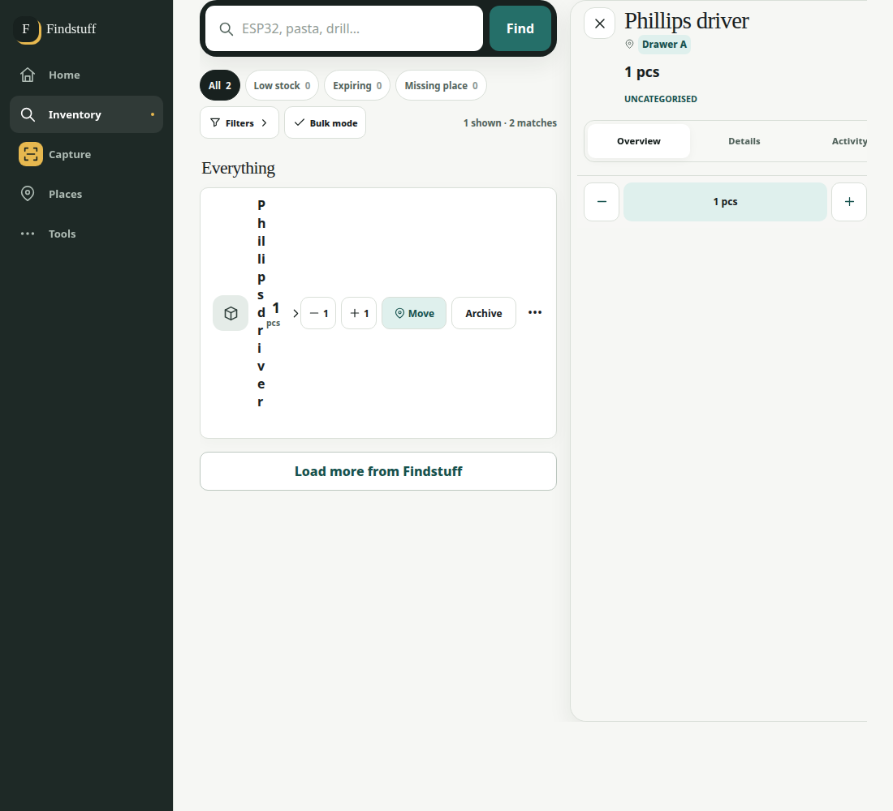
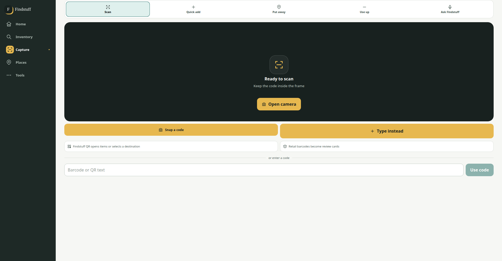
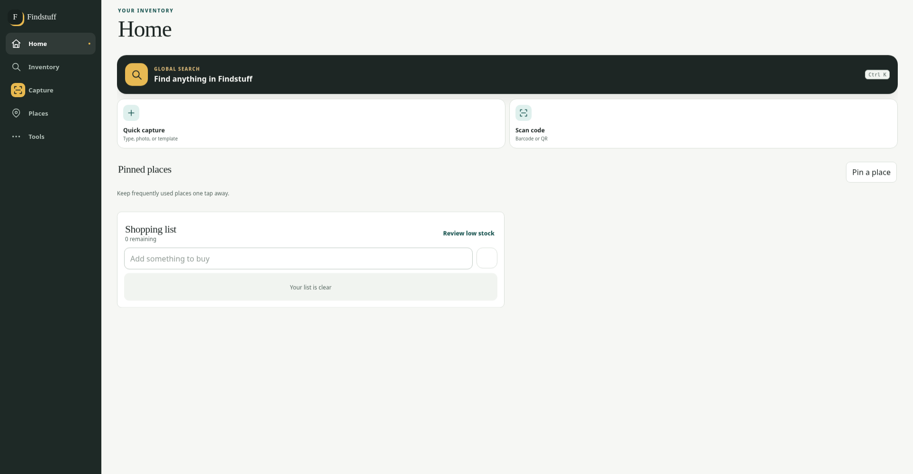

# Findstuff: product, UX, UI and reliability review

Review date: 18 September 2026. Scope: the current local working tree, including the preceding desktop-width change.

## Assessment

Findstuff has enough capability to be a useful, differentiated inventory product. Its strongest idea is connecting a physical object to a physical place, with fast capture and practical actions. Nested places, QR labels, category-specific data, documents, loans, projects, compatibility, reviewable AI proposals and offline operations make a strong foundation.

The next release should emphasize **trust, navigation continuity and task-focused layouts**. Adding more independent features before improving those foundations would increase the number of workflows users need to learn and maintain.

The desktop-width change addresses the large outside margins. It does not complete desktop adaptation: a wider page can still contain oversized controls, underused columns, crowded item actions and detail panels that do not fit a laptop. Desktop needs its own composition inside the shared shell.

This review identifies confirmed defects separately from source-derived risks and proposed improvements. Priorities mean:

- **P1:** fix promptly; affects inventory correctness, loss of work or access to core controls.
- **P2:** substantial usability, resilience or maintainability improvement.
- **P3:** useful enhancement after the core workflows are dependable.

Effort estimates are relative, not delivery promises: S = contained change, M = several connected components and tests, L = a substantial workflow or subsystem.

## What was checked

- Used the existing Graphify graph for orientation, then inspected the current implementation directly. The graph is not treated as authoritative when source differs.
- Ran the backend suite: **141 tests passed**.
- Ran the frontend unit suite: **28 tests passed across 9 files**.
- Ran the frontend architecture check: **74 source files checked; configured size limits and circular-import checks passed**.
- Ran the unused-code TypeScript check and backend Ruff lint: both passed.
- The preceding layout task also passed the production compilation and **22 existing Playwright browser tests**. Those results are from the preceding task, not a new full run in this review.
- Inspected browser screenshots of Home, Inventory, Capture, Places, Tools, Projects and Machines/models at **390, 1100 and 1920 CSS pixels**, plus item detail at those widths.
- Ran axe on **Home, Inventory and Tools at all three widths**: no reported violations in those nine fixture states. Other screenshot states were visually inspected; they were not all axe-audited.
- Reproduced capture draft loss, project-search misrouting, place-selection loss after refresh and a lost-response quantity replay using isolated browser fixtures. Confirmed Tab remains in the global-search input, and checked Inventory geometry at 320px.
- Reproduced the quantity replay sequence against a temporary real SQLite database as a separate check.

Browser data was synthetic and deliberately small. It demonstrates layout and behavior, not the actual completeness of your inventory or production performance. No live inventory records were changed. Settings, analytics, imports, backups, service-worker behavior and external integrations received source/test review rather than full live end-to-end operation. Physical camera quality, real phone Safari, power failure and production-network behavior remain untested. This is not a penetration test or a complete accessibility certification.

## Highest-priority findings

| ID | Finding | Evidence | Priority | Effort |
|---|---|---|---|---|
| R1 | A lost response to an online quantity adjustment can cause the adjustment to apply twice | Browser reproduction and real database sequence | P1 | M |
| U1 | Inventory detail clips on smaller desktop widths; item names can collapse into a vertical column | Browser measurement and screenshot at 1100px | P1 | S–M |
| U2 | Leaving Capture discards an unsaved reviewed item | Browser reproduction | P1 | M |
| U3 | Selected place is absent from the Places URL and disappears after refresh | Browser reproduction | P2 | M |
| U4 | Selecting a project in global search opens the project list | Browser reproduction and callback inspection | P2 | S |
| R2 | Additional quantity clicks during a failed in-flight adjustment can be dropped from the offline queue | Source-derived failure path; not independently browser reproduced | P1 | M |
| R3 | Local storage protection and storage-failure recovery are incomplete | Source inspection | P2 | M |
| R4 | Downloading a backup performs synchronous archive work inside an async request handler | Source-confirmed implementation; production delay not measured | P2 | M |
| R5 | Automatic backups snapshot the database before copying changing attachment directories | Source-derived consistency risk | P2 | M |
| R6 | Request timeout ends at response headers, before body parsing completes | Source inspection | P2 | S |
| T1 | Service-worker build plugin writes to a hard-coded output directory | Source inspection and preceding custom-output build behavior | P2 | S |

### R1 — Make quantity changes identifiable before the first network request

**Reproduction:** start with quantity 1, click Add one, simulate the server accepting the change but losing the response, then synchronize the queued change. The mocked server ends at **3**, although the user intended **2**. Separately, the real backend functions changed **5 → 4 → 3** when an online decrement was followed by the new offline decrement generated for that failed response.

The online request uses `api.adjust`, with an expected item version. On a network failure, `flushAdjustment` creates a new offline operation ID. The offline endpoint then uses the current item version to apply the delta. It cannot know that this is a replay of the earlier online request. Version checking alone does not connect these two paths.

**Change:** create and persist one operation ID before the first online attempt. Use that same ID for online submission, reconnect, retry and reload recovery. The backend should atomically store the quantity mutation and replay receipt. The existing offline endpoint already provides much of this foundation.

**Acceptance:** inject failures before submission, after server commit and during response delivery. Reconnect, reload, retry and use two tabs. One intended change must produce one inventory adjustment, and retries must return the original outcome.

Evidence: [online adjustment and fallback](../frontend/src/App.tsx), [API request shapes](../frontend/src/api.ts), [atomic offline replay](../backend/findstuff/offline.py).

### U1 — Base split layouts on available content width

At a viewport width of **1100px**, the shared content area is **822px** wide. Inventory's two columns require **440 + 16 + 560 = 1016px**. The detail panel extends to x=1262, outside the viewport. Overflow hiding conceals the excess. In the left panel, fixed action widths squeeze the item name until it wraps almost letter by letter.

**Change:** use a single-panel/detail-overlay layout until the actual content area can fit both panes. Ideally use container queries; otherwise choose a breakpoint that accounts for the navigation rail and gutters. Change item actions according to the card's width, with secondary actions beneath the title or in a menu. Merely increasing the viewport breakpoint will not solve every narrow-card case.

**Acceptance:** at 320, 390, 768, 1024, 1100, 1280, 1440, 1920 and 2560px, all essential actions remain visible, names remain readable and no pane exceeds its container. Also test browser zoom and long names. Measure child bounds, not only `document.scrollWidth`: hidden overflow can make that superficial check pass.

Evidence: [desktop grid and item action rules](../frontend/src/styles.css).

### U2 — Preserve work before Save

**Reproduction:** scan the fixture barcode, edit its proposed name, select Inventory, then return to Capture. The review card is gone. No draft recovery is offered.

Capture defaults, recent destinations and templates are persisted. The actual scanned review entries live in React state. Durable saving begins only when the user submits the item. These are different guarantees.

**Change:** persist the capture session and its attachment blobs in IndexedDB as the user works. Offer Resume draft and Discard draft; show when the draft has been saved locally. Add dirty-state protection to item, requirement and project editors. Navigation should preserve drafts; confirmation should be reserved for an explicit discard or a recovery limitation.

**Acceptance:** edit a multi-item scan session, navigate away, reload, close/reopen and briefly lose connectivity. Names, destinations, quantities and photos survive. Failed local draft storage is reported honestly.

Evidence: [Capture state and preferences](../frontend/src/features/capture/ScanView.tsx), [durable submitted capture](../frontend/src/features/capture/durableSave.ts).

### U3 — Make Places selection and history durable

**Reproduction:** open Places, select Drawer A, then refresh. The URL remains `?view=places`; the selected detail disappears. Category selection within the combined Places view has the same structural gap: route serialization only includes a location on the standalone location view and a category on the standalone category view.

**Change:** serialize Places tab and selected entity, for example `?view=places&section=locations&location=...`. Restore tree expansion sufficiently to reveal the selected node. Define how Back behaves between selections and between sections. Restore tree-pane scroll as well as document scroll.

**Acceptance:** copying the URL, refreshing, opening in another tab and using Back/Forward show the same selected entity. A stale/deleted entity gets a useful recovery screen.

Evidence: [route state passed to navigation](../frontend/src/App.tsx), [history hook](../frontend/src/features/shell/useNavigationHistory.ts).

### U4 — Search results should open the result

Project results in global search call `onNavigate("projects")`, losing the result's project ID. The browser check selected Toolhead upgrade and landed at `view=projects`.

**Change:** pass a direct project-open callback into the palette, just as items and places have one. Show the current project's meaningful progress/status rather than only legacy reservation count. Audit links to project detail elsewhere: some still use `view=projects&project=...` while the dedicated detail route uses `view=project`.

**Acceptance:** project search opens that project, its URL reloads correctly, and Back returns to the prior context.

Evidence: [GlobalSearch result mapping](../frontend/src/features/search/GlobalSearch.tsx), [project links in item detail](../frontend/src/features/items/ItemDetail.tsx).

### R2 — Preserve all rapid quantity clicks through failure

`flushAdjustment` removes the sent delta from `pendingDelta` before submitting it. If more clicks arrive during that request, they accumulate separately. Its network-failure branch deletes the queue entry and persists only the sent delta. The additional pending delta is not transferred in that branch.

**Change:** represent queued intentions explicitly and preserve both in-flight and not-yet-sent work. Avoid relying on a mutable accumulator without a durable lifecycle. Test failure while additional clicks are arriving, including alternating plus/minus clicks.

**Acceptance:** five accepted clicks remain five intended changes after disconnect and reconnect; the interface distinguishes pending from confirmed quantity. This is a source-derived concern, separate from the reproduced duplicate-application defect.

## UI and interaction direction

### 1. Design useful desktop compositions

The shell should use the screen, but individual work areas need deliberate proportions.

| Screen | Recommended desktop composition | Why |
|---|---|---|
| Home | Compact search/action area, then attention/recent work plus pinned places/shopping | Gives the extra width useful content |
| Inventory | Choose dense list/table or photo cards; optional inspector | Supports both comparison and visual recognition |
| Places | Searchable tree, adjustable divider, useful detail/overview | Preserves place context while browsing items |
| Capture | Scanner/input on one side, review queue on the other | Keeps intake and review visible together |
| Projects | Requirement list with compact readiness/budget summary | Keeps the next action visible during planning |
| Settings | Section navigation and a readable settings form | Avoids one long collection of unrelated panels |
| Data | Separate backup/recovery and import/export workflows | Makes different risk levels clear |

The current wide Capture screen makes the camera placeholder almost the entire page width. Home expands two quick-action cards and leaves a single shopping panel in a two-column container. These are observable compositions; the sparse fixture does not prove that the live app has no useful data.

**Priority:** P2, M. Introduce shared layout primitives for workspaces, inspectors, reading-width forms and action bars. Keep mobile as a first-class layout. Avoid a global rule that simply stretches every element.

### 2. Improve desktop navigation and vocabulary

The five main destinations work well as a mobile foundation. On desktop, the rail has room for frequently used secondary destinations or user-pinned shortcuts. Projects, shopping, AI review and backups should be discoverable without remembering where they are grouped.

Use consistent public language: **Tools** currently coexists with **More**, the component name **Extra**, and README references to Extra. Places screens also mix Place and location. Internal names can remain implementation details, but visible labels should agree.

Keep Settings and data recovery easy to locate. Consider a collapsible secondary section and pinned saved inventory views instead of permanently exposing every feature. Add a search launcher visible from every desktop section; Ctrl/Cmd+K already exists and should be advertised consistently.

**Acceptance:** a new user can find Projects, AI Inbox and Restore without instructions, and the breadcrumb/back label matches the destination.

### 3. Make Inventory easier to scan and compare

Inventory already has filters, saved views, grouping, bulk mode and server pagination. Improve their presentation rather than rebuilding them.

- Add an optional desktop table with aligned name, place, quantity/unit, category and status columns; retain cards for photo-led browsing.
- Offer comfortable and compact density. Persist the preference.
- Keep quantity controls and Move prominent; put Archive in a predictable secondary action area instead of giving it equal emphasis on every row.
- Clearly distinguish total matches, loaded records and selected records. Existing “Select visible” wording is a good safeguard; preserve it.
- Add a selection summary and per-item outcomes to large bulk operations. Offer Retry failed items, without replaying successes.
- Provide a visual filter-builder mode for common rules, while retaining the existing formula language for advanced users.
- Promote useful saved views and allow optional cross-device synchronization; they currently belong to the browser's local preferences.

**Acceptance:** compare quantities for ten similar components without opening each one; find and move several items without losing the current filters or selection scope.

### 4. Make Places a working browser

The tree has create, expand, edit, delete and print actions, but no dedicated search field in the inspected location-tree component. Add search that reveals matching branches and ancestors, plus Expand path, Collapse all and a clear selected-node state.

Replace the large initial “Select a Place” panel with a useful overview: pinned/recent places, unassigned items and a short explanation of the tree. Do not automatically open a potentially expensive branch merely to fill space. Consider a remembered/resizable divider.

Rename the destructive **Subtree** action to **Delete place and everything inside…** or another plain-language phrase. Its confirmation should enumerate affected child places and item archival consequences before submission. The existing confirmation already reports archived items; build on that.

**Acceptance:** find a deeply nested drawer by part of its name and identify whether a count is direct items or includes descendants.

### 5. Make Capture feel continuous

The five modes are useful, but their visual and behavioral distinctions need to be clear: Add, Scan, Put away, Use up and Ask Findstuff. On a PC, quick typing and keyboard barcode readers deserve equal visibility with the camera.

Create a review queue with per-card states: Looking up, Ready to review, Saving, Saved, Needs attention. Retain destination defaults and templates. For batch sessions, show how many items are saved and how many remain, and keep failed cards editable.

Optional enrichment should run after the saved state becomes visible. `applyCapture` currently waits for enrichment queue/run/results and candidate application after the main item is already saved; optional work can extend the perceived saving time. Show enrichment progress independently and preserve field provenance.

**Acceptance:** save several items quickly; one lookup failure does not block the rest, and a slow enrichment provider does not make a successfully saved item look unsaved.

### 6. Clarify item detail and editing

The existing Overview, Details and Activity separation is a good base. Make name, photo, current place, available quantity and key actions readable at first glance. Explain reserved quantity separately from total physical stock. Show inherited category fields and defaults with short, understandable labels.

Use a visible edit mode with Save/Cancel and draft protection. Keep rare/destructive actions away from frequent stock actions. Give links, documents and compatibility evidence a consistent presentation. Render each optional section according to capability and content; the existing tests already enforce part of this.

### 7. Reduce cognitive load in Projects

Projects already model requirements, allocated inventory, received stock and orders. The next improvement is helping users distinguish those quantities, not adding another competing planning model.

Offer task-based actions: **Link stock**, **Order missing**, **Receive delivery**, **Put into inventory**, **Use for build**. Show a preview of the exact quantity changes and where stock ends up. Preserve the detailed editor for exceptional cases. Explain readiness blockers beside the affected requirement.

Keep project budgets separated by currency and distinguish estimated, ordered and actually paid amounts. Do not imply that “ordered” means available for a build. Make compatibility conflicts visible before allocation.

### 8. Use a readable typography and action system

The visual identity—dark rail, muted backgrounds, teal accents and warm capture emphasis—is coherent. Keep it. Improve consistency and legibility before a visual rebrand.

Several labels/badges use approximately `.58rem`–`.65rem`. At a 16px root size, `.58rem` is about 9.3px. That is a design readability concern, not automatically a WCAG failure. Reserve very small type for truly secondary decoration; use roughly 12–14px for useful metadata and 14–16px for common controls, validated at actual device sizes.

Standardize spacing, button hierarchy, border radii, badges and destructive-action treatment. There are repeated late CSS overrides and multiple breakpoint systems in the 2,571-line stylesheet. Extract tokens and feature styles gradually as screens are improved; avoid a risky all-at-once rewrite.

## Accessibility and keyboard behavior

The sampled axe checks passed, and the app already has a shared dialog manager, labels, status messages and visible-focus styling. Keep those investments.

The next checks must be behavioral:

- In global search, Tab and Shift+Tab currently change the active result from the input. A browser check confirmed that pressing Tab leaves focus in the input. This can prevent normal forward keyboard access to Close, Retry and Load more. Use arrow keys for result navigation and preserve a clear Tab sequence. Validate Home/End behavior while editing text too. See the [WAI combobox pattern](https://www.w3.org/WAI/ARIA/apg/patterns/combobox/).
- Test nested dialogs, return focus, Escape and background inertness on every editor. DOM-order-based modal management needs coverage when new overlays are added.
- Add a reduced-motion preference; no `prefers-reduced-motion` handling was found in the inspected stylesheet.
- Check focus contrast in both themes. The current focus ring is a translucent color, so effectiveness depends on the background.
- Test reflow at 320 CSS pixels, zoom, long translated text and on-screen keyboards. [WCAG reflow guidance](https://www.w3.org/WAI/WCAG22/Understanding/reflow.html) makes this a more useful target than merely hiding overflow.
- Verify live announcements for saves, conflicts and failed synchronization without repetitive notification spam.
- Test actual iPhone/Safari camera, voice, keyboard and PWA behavior. Chromium emulation is not evidence for Safari correctness.

## Reliability, recovery and performance

### R3 — Make local-only state explicit and protect it

Offline queue writes wait for IndexedDB transaction completion, which is good. Full inventory download is also committed after all pages have been fetched. The app correctly explains that cached records are separate from a backup and that documents/photos need a connection.

However, no use of `navigator.storage.persist()` or `navigator.storage.estimate()` was found. Storage pressure and site-data deletion need an explicit recovery design. Best-effort browser storage may be evicted; persistence is browser-dependent and cannot prevent the user clearing site data. See [MDN storage behavior](https://developer.mozilla.org/en-US/docs/Web/API/Storage_API/Storage_quotas_and_eviction_criteria).

**Change:** request persistence when justified by offline use, show storage usage when available, handle quota failures without reporting a successful local save, and provide export/recovery of unsynchronized changes. Distinguish Draft on this device, Pending sync, Saved on server and Photo pending. Avoid a generic “saved” label for all of them.

### R4 — Keep expensive work away from the request event loop

The fresh-backup download route is `async def` but directly calls synchronous SQLite backup, filesystem copying and ZIP compression. Many ordinary routes also call synchronous database functions. Large operations can delay other requests handled by that process. This review did not measure the delay on your server.

The import route already demonstrates a useful pattern: dispatch work to a thread and create/close the SQLite connection within that work. Reuse a deliberate pattern rather than moving an existing thread-bound connection blindly.

**Acceptance:** run an attachment-heavy backup while another client searches and adjusts stock. Measure response latency and event-loop delay. Consider an asynchronous backup job with progress and a download-ready result. [FastAPI's concurrency documentation](https://fastapi.tiangolo.com/async/) explains the relevant execution distinction.

### R5 — Verify complete backup consistency and recoverability

Backups use SQLite's backup API, stage output before completion, validate restore archives and create a safety backup before replacement. These are strengths.

The automatic backup then copies photo/document directories after the database snapshot. A concurrent deletion can remove a file referenced by that snapshot before copying it. This is a source-derived race risk, not a claim that current backups are already damaged.

**Change:** coordinate attachment lifecycle and backup creation, retain referenced immutable files while a backup is in progress, or otherwise provide a consistent snapshot boundary. Validate the completed artifact before marking it healthy or pruning previous good backups. Add foreign-key and file-reference checks as appropriate, and record verification results.

Data already exposes backup age, off-device-copy uncertainty and restore status. Extend that into a real recovery exercise: restore to an isolated instance, count records, open sample documents/photos and verify migrations. Local backups on the same disk remain useful, but do not by themselves cover loss of that machine.

**Acceptance:** upload/delete attachments during backup; the completed archive restores with all referenced files. A failed validation must preserve the prior valid backup and provide a clear failure message.

### R6 — Bound the entire request and explain ambiguous outcomes

The API helper clears its timeout and removes the external abort listener in the `finally` around `fetch`, before `response.json()` runs. The timer therefore covers obtaining response headers, not necessarily a stalled body.

**Change:** keep the timeout active through body consumption. Distinguish read failure, validation failure, authentication expiry, conflict and an unknown mutation outcome. “Try again” is unsafe advice unless the mutation is replay-safe or the client first reconciles its outcome.

**Acceptance:** send headers immediately but stall/truncate the body; cancellation and timeout still complete predictably. For writes, retry never applies a second mutation.

### Database durability should be a deliberate product choice

SQLite uses WAL with `synchronous=NORMAL`. That is a valid performance trade-off, but recent committed transactions may be lost after power loss or an OS crash; it is not equivalent to a database-corruption finding. This matters for a self-hosted Pi or home server. See [SQLite's synchronous documentation](https://sqlite.org/pragma.html#pragma_synchronous).

Benchmark a stronger durability setting on the target hardware, then document or expose the choice appropriately. Test restoration and abrupt-process-stop behavior separately from power-loss guarantees. Do not promise power-loss safety based only on passing transaction tests.

### Refresh only as much data as necessary

`AutoOfflineInventory` downloads the entire inventory on initial activation, visibility changes and every five minutes. In-page concurrent downloads are deduplicated, which is good; multiple tabs and devices can still repeat the work.

Introduce freshness checks, incremental changes/deletions, jitter/backoff, and optional cross-tab coordination. Keep a periodic full reconciliation as a repair mechanism. Refresh metadata on focus only when stale. Do not make an expensive full download the prerequisite for immediate interaction.

The project-list endpoint constructs full project details for each project, including requirements and completion snapshots. Global search fetches that list on opening. Split lightweight list/search summaries from full project detail and paginate where appropriate.

**Acceptance:** benchmark realistic collections with deep places, photos and substantial project histories. Measure actual target hardware, not just desktop development timings. The current backend performance fixture contains 180 items; its passing budget does not establish performance at 10,000 items.

### Improve observability and recovery paths

Give background work consistent state and timestamps: queued, running, retrying, failed and complete. Expose the last successful sync, oldest pending change, last good backup and actionable failed jobs. Retry independent failures without silently dropping them; keep ordering where later work depends on earlier operations.

Use request/operation IDs in errors and logs so a UI failure can be connected to a server result. Provide a downloadable diagnostic bundle that excludes credentials and private item content by default. Keep the ordinary UI's wording task-based; raw technical detail can be expandable.

Audit app-wide session expiry while editing or syncing. A login interruption should preserve drafts and pending operations, then resume safely. This is a recommended failure drill, not a demonstrated authentication defect.

### T1 — Respect the configured build destination

The Vite service-worker plugin writes to `frontend/dist/sw.js` through a hard-coded URL, regardless of Vite's configured `outDir`. A build into a temporary directory still changes the normal dist worker and can pair it with a manifest of assets that are not present there.

**Change:** obtain the resolved Vite output directory and emit the worker into the same build artifact as the assets. Test custom output directories and verify every precache URL exists in the final artifact. Exercise old and new tabs through a real production service-worker update; development-server tests do not test this lifecycle.

Evidence: [service-worker build plugin](../frontend/sw-build.mjs), [service-worker template](../frontend/public/sw.js).

## Feature investments worth making

These are product proposals, not claims that every related capability is absent.

| Proposal | User benefit | Build on | Priority |
|---|---|---|---|
| Guided stocktake by place | Reconcile what is physically there with recorded quantities | QR places, quantities, history | P2 |
| Delivery-to-stock workflow | Receive purchased project parts, choose destination and update planning once | Existing project receipt/stock operations | P2 |
| Resume unfinished work | Return to an interrupted capture, edit or bulk review | Draft persistence and recent navigation | P1/P2 |
| Cross-device saved workspaces | Reuse filters, density and shortcuts on PC and phone | Existing saved inventory views/preferences | P2 |
| Duplicate reconciliation | Review likely duplicates and merge with a preview and provenance | Existing duplicate detection and import tools | P2 |
| Unified attention inbox | One place for expiring items, overdue loans, pending AI, failed sync and maintenance | Existing Home reminders and AI Inbox | P2 |
| Better loan follow-through | Know who has an item, when it is due and mark partial returns clearly | Existing loans and reminders | P2 |
| Evidence-aware enrichment | Show source, retrieval date, confidence and field-level changes | Existing enrichment candidates/provenance | P2 |
| Localized language and number entry | Reduce friction for Italian names, dates and decimal input | Existing locale formatting | P2 |
| Optional cached place photos | Recognize a drawer/item while disconnected | Existing offline records and thumbnails | P3 |
| Household/team roles | Allow safe shared use without universal administration | Existing authentication | P3, if shared use is a real goal |
| Exportable inventory/warranty pack | Make moving, maintenance and ownership documentation easier | Existing documents and exports | P3 |

A stocktake should record counted quantity, expected quantity, discrepancy reason and a confirmed adjustment; opening a scan should not silently reset stock. Duplicate merging should preserve documents, history, containers and project links. A unified attention view should distinguish urgent actionable items from optional metadata cleanup.

Avoid starting with more integrations or additional AI modes unless they shorten a specific recurring task. Existing capabilities will feel more valuable when users can reliably find them, finish a task and return later without losing context.

## Suggested implementation sequence

### Pass 1 — Trust and core usability

1. Unify online/offline quantity operation identity and preserve queued clicks.
2. Add lost-response, concurrent-click, reconnect and reload recovery tests.
3. Fix the inventory inspector breakpoint and narrow-card action layout.
4. Persist capture drafts; add a consistent dirty-editor policy.
5. Fix direct project search and Places route state.
6. Correct the request-body timeout and custom-output service-worker build.

Deliverable: the user can adjust stock, review captures and navigate on a laptop without incorrect quantities, lost work or clipped controls.

### Pass 2 — A coherent desktop and mobile product

1. Compose Home, Capture and Places for wide screens.
2. Add optional dense inventory presentation and bounded inspectors.
3. Normalize Tools/More/Places wording and shortcut discovery.
4. Add tree search and useful empty states.
5. Standardize type, actions and spacing.
6. Fix keyboard palette behavior and complete zoom, reduced-motion and dark-theme checks.

Deliverable: five common tasks are straightforward on both PC and phone, with remembered context and consistent controls.

### Pass 3 — Recovery and realistic scale

1. Isolate expensive backup work and validate completed artifacts.
2. Test backup consistency while attachments change.
3. Add local-storage health and unsynced-work recovery.
4. Reduce full refreshes and project-list payloads.
5. Exercise authentication expiry, service-worker upgrades and backend outages.
6. Establish latency and recovery targets on the actual server hardware.

Deliverable: failure states are understandable and recoverable, with measured behavior at the collection sizes you expect.

### Pass 4 — Extend the best workflows

Choose stocktake, delivery-to-stock, duplicate reconciliation or shared saved views based on the task you repeat most. Give each one a complete happy path, failure path, undo policy and browser coverage before adding the next.

## Verification plan for the next release

| Area | Scenarios | Success condition |
|---|---|---|
| Stock changes | Lost response, double click, concurrent tabs, offline replay | Correct final quantity; one receipt per intention |
| Capture | Navigate away, reload, failed upload, quota failure | Draft survives or failure is explicit; no false saved state |
| Navigation | Direct URL, Back/Forward, refresh, nested place selection | Same entity, scope and appropriate scroll restored |
| Layout | Small phones, laptops, ultrawide, zoom, long names | Essential content and actions stay reachable |
| Accessibility | Keyboard-only, nested dialogs, announcements, both themes | Predictable focus and understandable state changes |
| Backup | Concurrent attachment changes, interrupted creation, clean-host restore | Valid artifact and recoverable complete dataset |
| Performance | Large inventory, deep hierarchy, long project history | Agreed p95 latency on target hardware |
| PWA | Production build, old tab/new release, unavailable chunk, cold offline start | No mismatched assets or loss of pending work |
| Integrations | Provider timeout, malformed result, restart during job | Visible retry/recovery without duplicate effects |

Do not replace the existing test suite. Add tests around these transitions, where the current passing suite left gaps. Use fixtures generated from real API contracts or a disposable backend for a smaller integration suite; mocked browser tests alone can agree with an incorrect fixture.

## Suggested success measures

Use local/manual measurement initially; a self-hosted app does not need intrusive telemetry to learn from its own workflows.

- Time to find an existing item and identify its exact place.
- Time to add an item with a destination, including photo if needed.
- Time to receive project parts into inventory.
- Number of interactions to move several items.
- Recovery success after losing connectivity mid-save.
- Age and count of pending changes.
- Percentage of backup drills that restore usable records and attachments.
- Keyboard completion rate for search, capture review and item editing.
- Search and save latency under realistic server load.

The strongest next milestone is a dependable loop: **find an item, understand its state, change it, see exactly what was saved, and return to the same context later**.

Evidence files: [measured screen observations](review-assets/2026-09-18/browser-observations.json) and [focused reproduction outcomes](review-assets/2026-09-18/reproduction-outcomes.json).
